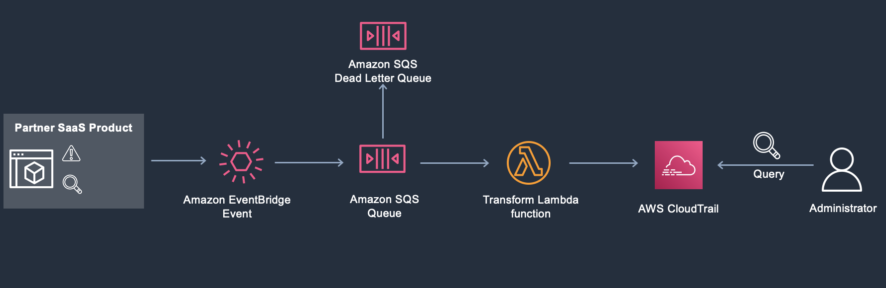
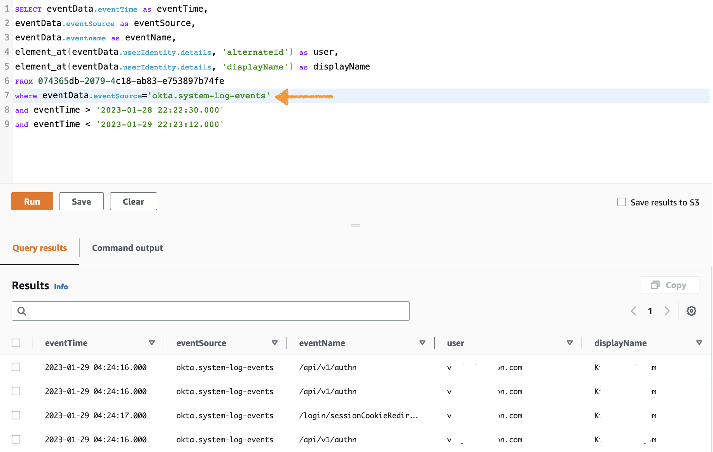
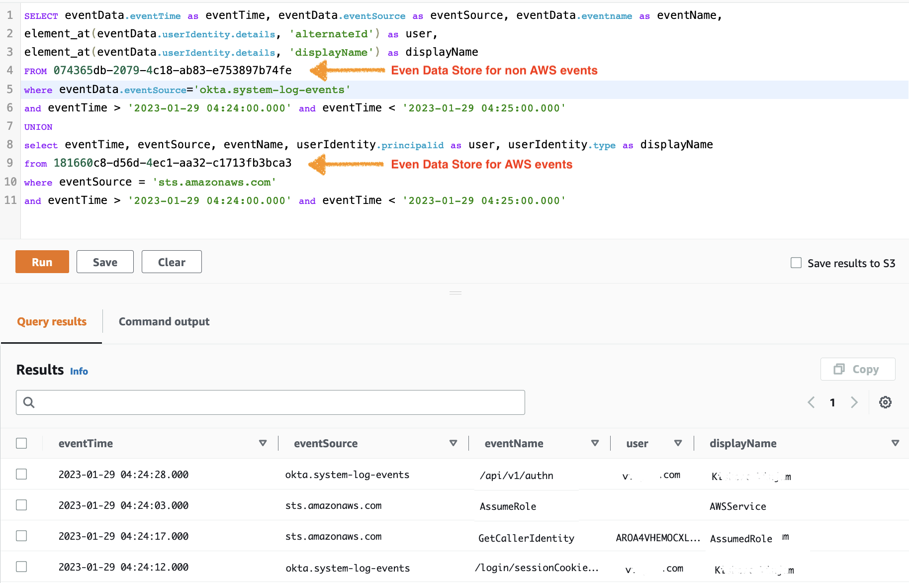

# Get visibility into the activity logs for your workforce and customer identities

The customers we work with often use identity services like Okta to authenticate their [workforce identity](https://www.okta.com/workforce-identity/) into the AWS environment, and [customer identity](https://www.okta.com/customer-identity/) service to build authentication into their business applications. In addition, we see customers using other partner solutions in security, cost management, cloud operations, and observability categories. We have heard that our customers want visibility into the activity logs from non-AWS sources along with AWS sources in a single data source.

Using [AWS CloudTrail Lake](https://docs.aws.amazon.com/awscloudtrail/latest/userguide/cloudtrail-lake.html), which is a managed data lake, you can aggregate, immutably store, and query events recorded by CloudTrail across your AWS Accounts and Regions. CloudTrail Lake now supports [ingesting activity logs from non-AWS sources](https://docs.aws.amazon.com/awscloudtrail/latest/userguide/query-event-data-store-integration.html). This lets you collect activity logs from any source in your hybrid environments, such as in-house or Software-as-a-Service (SaaS) applications hosted on-premises or in the cloud, virtual machines (VMs), or containers. You can immutably store the events for your auditing and compliance needs, security investigations, and operational troubleshooting. Furthermore, the stored data can be analyzed using a standard SQL based queries. 

[Amazon EventBridge](https://aws.amazon.com/eventbridge/) [ingests data from supported SaaS platforms](https://aws.amazon.com/eventbridge/integrations/) and routes to AWS Service targets. EventBridge lets you easily connect to and steam data from your SaaS applications without writing any code. Several AWS partners like Okta are already integrated with EventBridge and can start streaming the data with minimum configuration steps.

In this post, you’ll learn to get started sending activity logs from partners like Okta into CloudTrail Lake. You’ll leverage Okta’s ability to [Add an Amazon EventBridge log stream](https://help.okta.com/en-us/Content/Topics/Reports/log-streaming/add-aws-eb-log-stream.htm) to get logs into AWS, transform them into the CloudTrail format, and ingest them into CloudTrail Lake. In addition, you’ll utilize common SQL like statements to query the data and derive the required insights. 

A few examples of the insights include the count of events for each target or event name, as well as a consolidated view of partner activity along with [Amazon API Gateway](https://aws.amazon.com/api-gateway/) activities in your environment.

## Prerequisites

Before configuring this solution, conduct the following tasks:

* We assume that you’re using Okta to federate your corporate users into the AWS account. For this post, I used an [Okta developer account](https://developer.okta.com/signup/) and [integrated with AWS SSO](https://docs.aws.amazon.com/singlesignon/latest/userguide/okta-idp.html).

* Follow the instructions in [Add an AWS EventBridge log stream](https://help.okta.com/en-us/Content/Topics/Reports/log-streaming/add-aws-eb-log-stream.html) documentation to send Okta system log events to EventBridge.

* Create an [Event Data Store in CloudTrail Lake](https://docs.aws.amazon.com/awscloudtrail/latest/userguide/query-event-data-store.html) to store events from non-AWS sources.

* [Create a CloudTrail channel](https://docs.aws.amazon.com/awscloudtrail/latest/userguide/query-event-data-store-integration.html) in your AWS Account. 

When you deploy this solution, you’re responsible for the charges associated with additional services used in addition to the [EventBridge cost](https://aws.amazon.com/eventbridge/pricing/). Additional services include [SQS queue](https://aws.amazon.com/sqs/pricing/), AWS [Lambda](https://aws.amazon.com/lambda/pricing/), and [CloudTrail Lake](https://aws.amazon.com/cloudtrail/pricing/) ingestion and query cost. 

The source code for this solution is available [here](https://github.com/aws-samples/aws-cloudtrail-lake-okta-system-log-events).

## Solution Overview

Using the [AWS CloudFormation](https://aws.amazon.com/cloudformation/) template provided in this post, you can enable the streaming of activity logs from Okta into CloudTrail Lake. You can achieve this by extending the current EventBridge integrations with Okta log stream.  

 *Solution Architecture diagram*

Deploy the CloudFormation stack in the AWS Account where you configured the prerequisites. 

The CloudFormation stack provided as part of this post deploys following:
1. Create an EventBridge rule on the partner Event Bus. The partner Event bus is created when you enable [AWS EventBridge log stream on Okta](https://help.okta.com/en-us/Content/Topics/Reports/log-streaming/add-aws-eb-log-stream.htm). 
2. The rule receives all of the events from Okta and sends them to the target. In this solution, the [Amazon Simple Queue Service (Amazon SQS)](https://aws.amazon.com/sqs/) queue is used as the target.
3. The events are queued in Amazon SQS and processed by a Lambda function. The Lambda function conducts the following:

    a.	Convert the Okta event into an Open Audit Event Schema

    b.	Ingest the event into CloudTrail managed Event Data Store.

4. The queue is configured with Dead Letter Queue (DLQ) to collect any events that have failed to get ingested into CloudTrail Lake.   
5. Once the events are collected in the managed event data store, you can query and derive the insights of the events using SQL like queries.

## Walkthrough

#### Step-1: Launch the solution

Download the CloudFormation template from the Git repository and launch it your AWS account to deploy all the components shown above in the solution overview section.

1. Clone the [Git repository](https://gitlab.aws.dev/vinjak/aws-cloudtrail-eventbridge-partner-integrations) or download the files on your local workstation. 
2. Log in to the AWS Account where you performed the above prerequisites. 
3. Create a CloudFormation stack. Type in the values for the following Parameter keys.
    * ***PartnerEventBusName***: Navigate to Amazon EventBridge, Event buses, and Custom event bus, and note down the Name for the Event bus created for Okta integration.
    * ***PartnerRuleName***: Enter any name for the rule (default: partner_event_process_rule)
    * ***ChannelArn***: Channel the ARN that you created as part of the prerequisites.
    * ***S3BucketLocation***: [Amazon Simple Storage Service (Amazon S3)](https://aws.amazon.com/s3/) bucket location where the Lambda function packages are stored. You can leave the default value, unless you downloaded the code and hosted it in your S3 buckets.
4. Wait for the Stack Status to change to CREATE_COMPLETE, and then proceed to the next step.

#### Step-2: Generate some events on Okta

1. Log out from both the AWS accounts and your Okta console. Alternatively, you could use a new browser to perform the next steps.
2. Log in to the Okta Console with a user-ID that doesn’t exist to simulate a failure event.
3. Log in with the correct credentials to generate some additional events as well.

#### Step-3a: Query the ingested non AWS events in CloudTrail Lake

1. Navigate to the AWS CloudTrail console.
2. Choose Lake on the left pane, and Editor.
3. Copy and paste the following query in the editor window.

`
SELECT eventData.eventTime as eventTime, 
eventData.eventSource as eventSource, 
eventData.eventname as eventName, 
element_at(eventData.userIdentity.details, 'alternateId') as user, 
element_at(eventData.userIdentity.details, 'displayName') as displayName 
FROM 074365db-2079-4c18-ab83-e753897b74fe 
where eventData.eventSource='okta.system-log-events'
and eventTime > '2023-01-30 22:22:30.000' 
and eventTime < '2023-01-31 22:23:12.000'
`

4. Choose the Event data store that you created as part of the pre-requisites. It will automatically update the event data store value in the query.
5. Adjust the eventTime to time duration after this solution deployment. The output looks like below.

*Query non-AWS events from CloudTrail Lake*

Step-3b: Query both AWS and non-AWS events in CloudTrail Lake

As the user gets authenticated through Okta ang login to AWS, you could overlay the Okta events with AWS events to understand complete set of activity that occurred. You could do this by querying two different event data stores with in CloudTrail lake. You can use UNION to group together the events. Using the below sample query, you can overlay both Okta and AWS events: 

1.	Copy and paste below query in the editor window.

`
SELECT eventData.eventTime as eventTime, eventData.eventSource as eventSource, eventData.eventname as eventName, 
element_at(eventData.userIdentity.details, 'alternateId') as user,
element_at(eventData.userIdentity.details, 'displayName') as displayName 
FROM 074365db-2079-4c18-ab83-e753897b74fe
where eventData.eventSource='okta.system-log-events'
and eventTime > '2022-09-08 22:22:30.000' and eventTime < '2022-09-08 22:23:12.000'
UNION
select eventTime, eventSource, eventName, userIdentity.principalid as user, userIdentity.type as displayName
from 181660c8-d56d-4ec1-aa32-c1713fb3bca3
where eventSource = 'sts.amazonaws.com'
and eventTime > '2022-09-08 22:22:30.000' and eventTime < '2022-09-08 22:23:12.000'
`

2.	Adjust the event data store and eventTime as per your environment. The output looks like below.

*Query both AWS and non-AWS events together from CloudTrail Lake*

## Clean up
If you’re experimenting and want to clean the resources created after the testing or decide not to go with this approach, then you can [delete the CloudFormation stack](https://docs.aws.amazon.com/AWSCloudFormation/latest/UserGuide/cfn-console-delete-stack.html) that you created as part of Step-1. This clears all of the resources created by this solution.

## Conclusion
In this post, you learned how to leverage EventBridge to send the activity logs from partners like Okta to CloudTrail Lake. You also ran a query to list the non-AWS events and overlay them with AWS events from CloudTrail Lake. The queries are built using commonly used SQL like statements to derive additional insights.

## Security

See [CONTRIBUTING](CONTRIBUTING.md#security-issue-notifications) for more information.

## License

This library is licensed under the MIT-0 License. See the LICENSE file.
